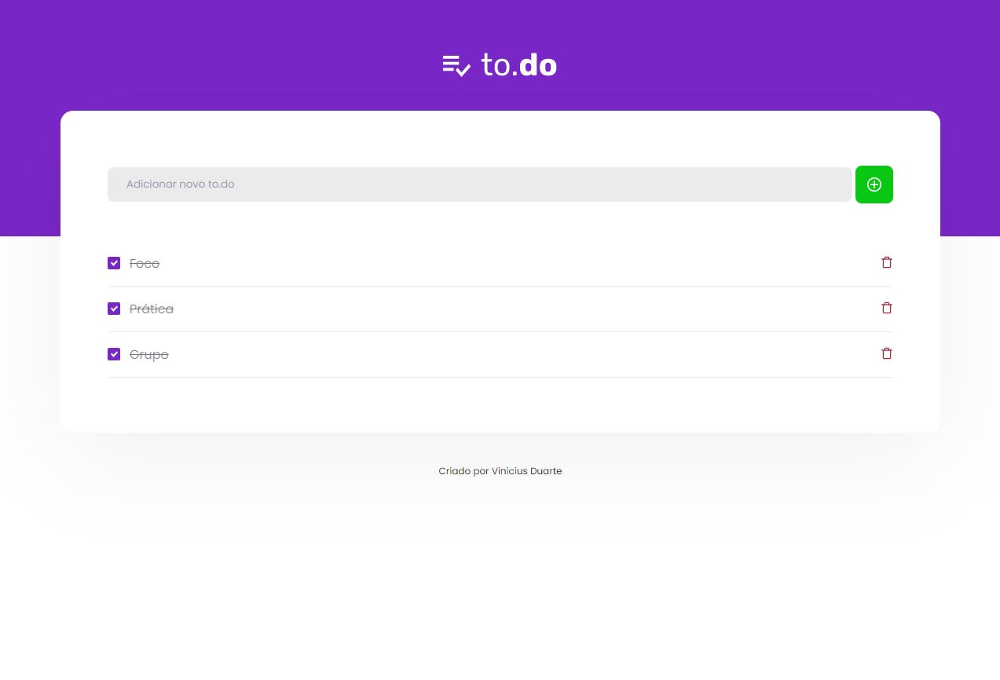
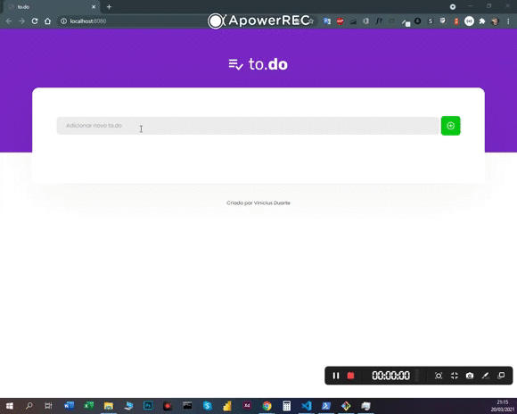

<h1 align="center">
  to.do List
</h1> 

<p>
   Screenshot da Página Principal
</p> 

<p align="center">
   
</p> 

<p>
   Demostração em video
</p> 

<p align="center">
   
</p> 


## Sobre

**to.do List** foi um desafio criado no **Bootcamp Ignite**, o projeto consiste em fazer a gestão de tarefas em geral.


## Ferramentas

O projeto foi desenvolvido utilizando as seguintes tecnologias:

- **HTML5**
- **CSS3/SCSS**
- **TypeScript**
- **ReactJS**


## Para iniciar

```bash

    # clone repository
    $ git clone https://github.com/ViniciusMDuarte/desafio01-ignite.git

    # Enter directory
    $ cd desafio01-ignite

    # Install package
    $ yarn
    
    # Start the project
    $ yarn dev

    # View browser
    $ http://localhost:8080/
```
